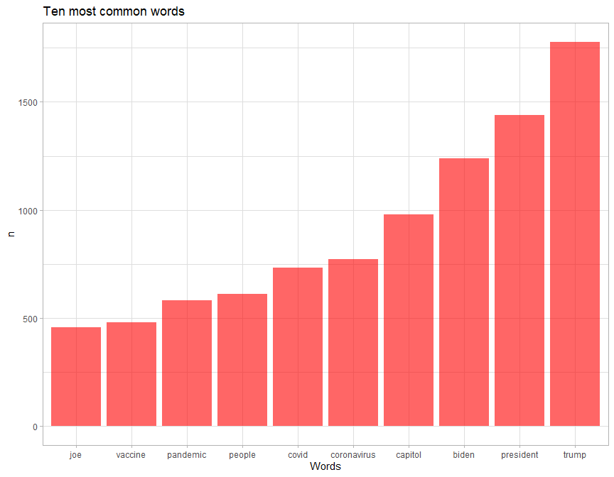
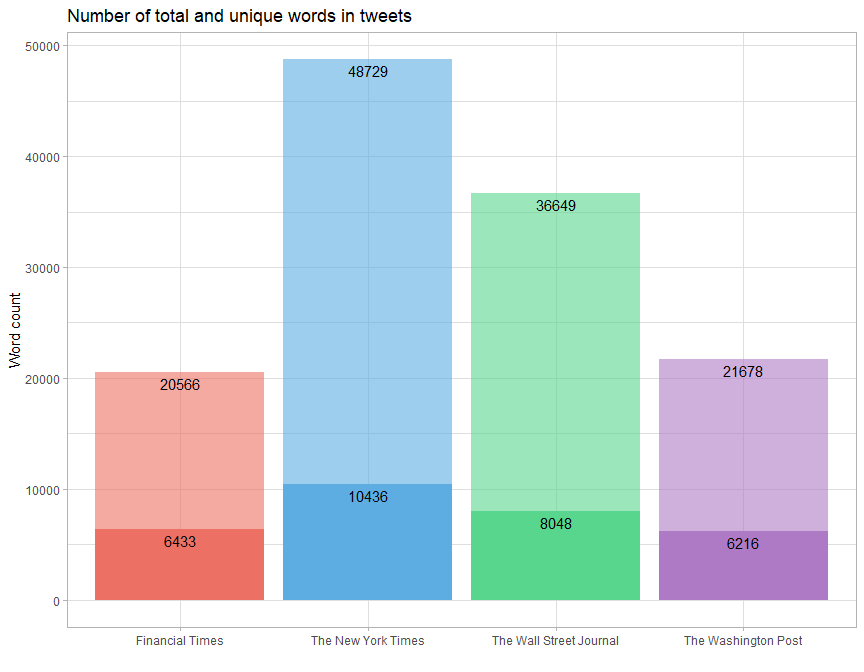
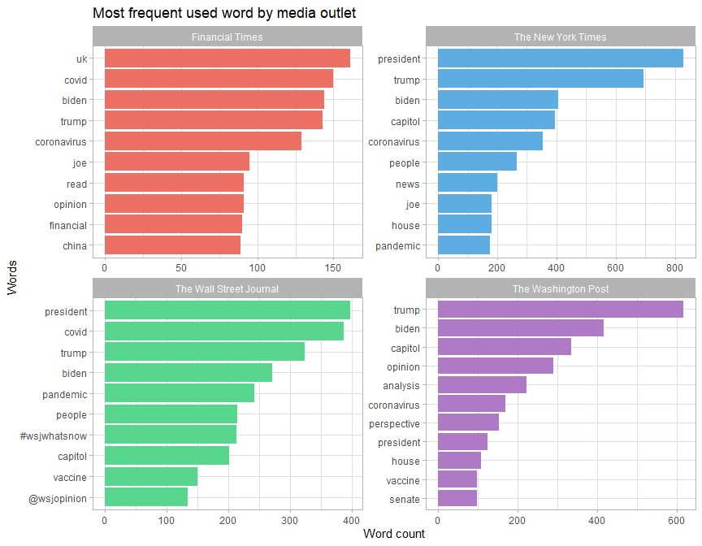
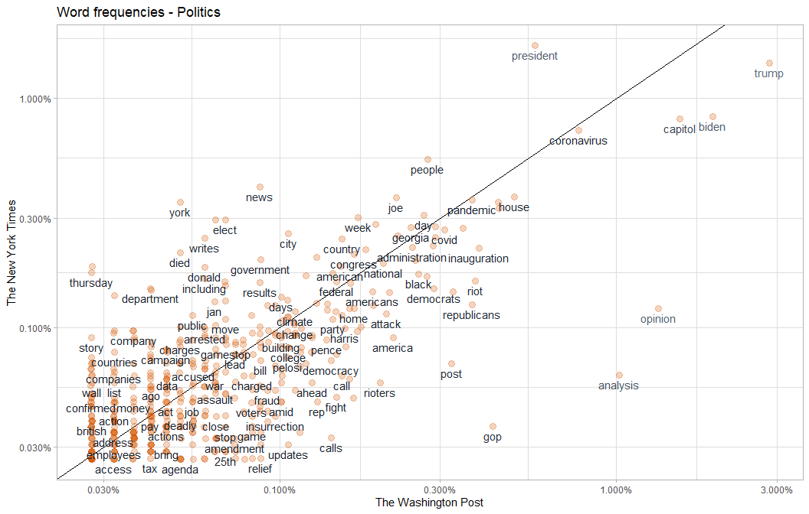
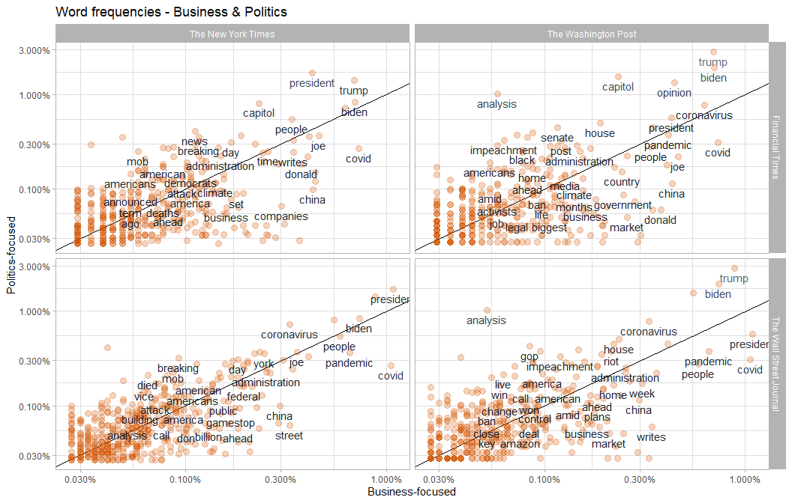
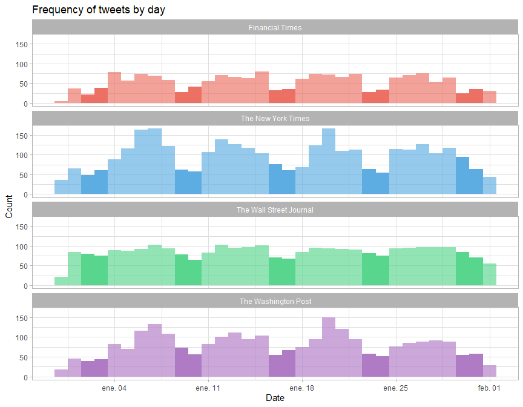
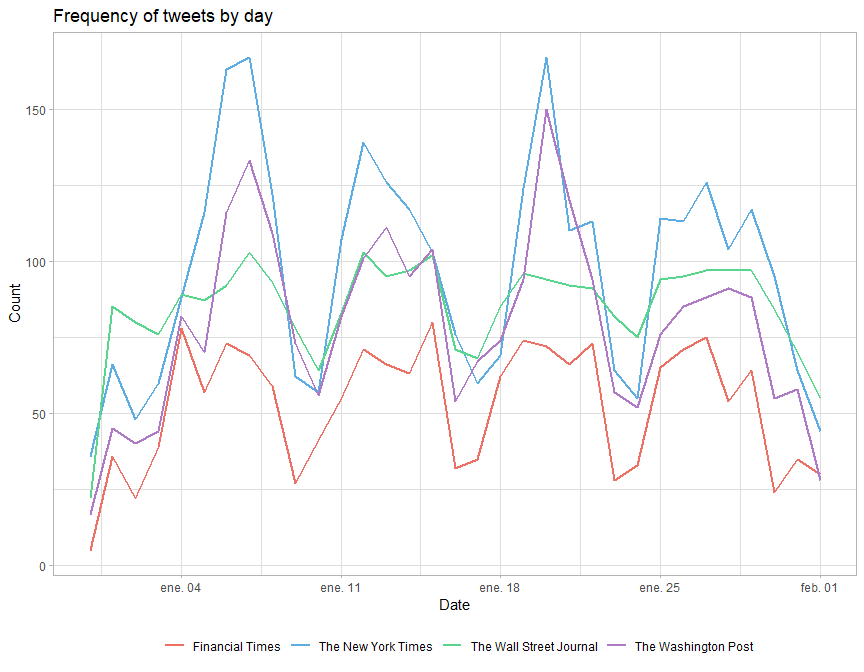
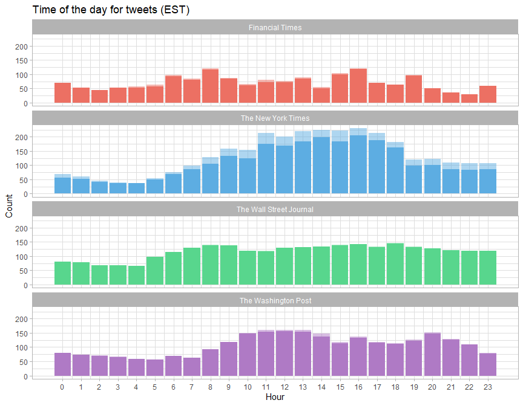
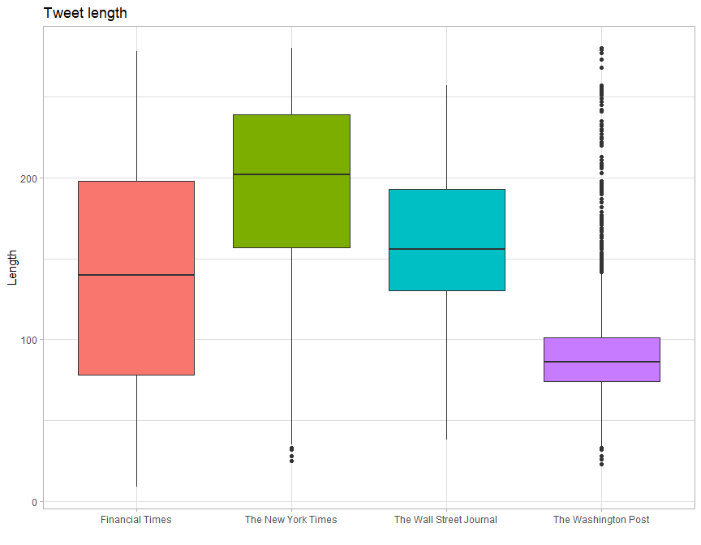
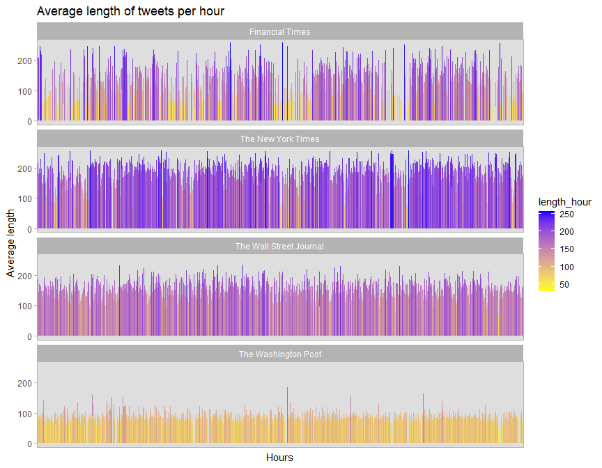

### Text Mining using tweets

This project is about...

```r
library(rtweet)
library(tidyverse)
library(tidytext)
library(stopwords)
theme_set(theme_light())
color1 <- c("#EC7063", "#5DADE2", "#58D68D", "#AF7AC5")

library(scales) 
library(reactable) 
library(lubridate) 
library(corrplot)
library(wordcloud2)
```


```r
### Importing tweets
# api keys
# create_token(app = 'tw_recent',
#              consumer_key = "XXX",
#              consumer_secret = "XXX",
#              access_token = "XXX",
#              access_secret = "XXX")

# tw_retrieve <- get_timeline(c("WSJ","nytimes","business","FinancialTimes","washingtonpost"), n=3200)

# write_as_csv(tw_retrieve, "21_media.csv")
```

```r
### Overview
tw_original <- read_twitter_csv("C:/Users/G3/Documents/Gabriel/Profile/Projects/twitter-sa/21_media.csv")

tw_original %>%
  group_by(name) %>%
  summarize(n = n())
```

```
## # A tibble: 5 x 2
##   name                        n
##   <chr>                   <int>
## 1 Bloomberg                3200
## 2 Financial Times          3200
## 3 The New York Times       3200
## 4 The Wall Street Journal  3200
## 5 The Washington Post      3200
```
Considering the most popular media outlets in the US, I randomly picked five major newspapers to compare how different their timelines in Twitter are from one another. Financial Times is London-based, however it usually gives a large coverage of news related to the US. Moreover, the idea is to find how different is the content of the timelines from two groups of newspapers: the ones, which are known for their political reporting, from the ones that are known for their focus on business and economy. In this sense, I decided to classify these newspapers based on my own impression about the focus of each media outlet. Therefore, 'The New York Times' and 'The Washington Post' are considered as the politics-focused, whereas 'Financial Times' and 'The Wall Street Journal' are business-focused.


```r
# Filtering tweets and variables 
tw_media <- tw_original %>%
  mutate(date = as_datetime(created_at)) %>%
  filter(lang == "en") %>%
  select(name, date, text, source, is_retweet, favorite_count, 
         retweet_count, lang, geo_coords, status_id)

# Defining time period
tw_media %>%
  group_by(name) %>%
  mutate(n = n(),
         initial = min(date),
         diff = max(date) - min(date)) %>%
  select(name, n, initial, diff) %>% 
  unique()
```

```
## # A tibble: 5 x 4
## # Groups:   name [5]
##   name                        n initial             diff         
##   <chr>                   <int> <dttm>              <drtn>       
## 1 The Wall Street Journal  3199 2020-12-27 06:15:02 36.33337 days
## 2 The New York Times       3192 2020-12-31 19:15:08 31.78815 days
## 3 Bloomberg                3193 2021-01-22 11:17:04 10.12546 days
## 4 Financial Times          3185 2020-12-01 13:30:07 62.02860 days
## 5 The Washington Post      3195 2020-12-22 17:44:05 40.85071 days
```
Initially, I also wanted to use the timeline from Bloomberg, but decided to exclude it from the analysis after checking the timeline period of their tweets. It appears that the frequency of new tweets is higher in comparison to the rest of newspapers. This implies that the retrieved tweets from Bloomberg only cover a little less than two weeks, whereas the rest of newspapers go over a month. Therefore, I decided to remove those tweets. I also limited the time period to go from the first tweet of the New York Times timeline to the date these tweets were retrieved. It is important to consider that the defined period will not cover the entire retrieved timeline from The Washington Post by more than 10 days and The Wall Street Journal by more than five days.
The defined time period will cover tweets from 2020-12-31 until 2021-02-01.


```r
tw_media <- tw_media %>%
  filter(name != 'Bloomberg',
         date >= min(date[which(name == "The New York Times")]))

# Number of tweets for each outlet
tw_media %>%
  group_by(name) %>%
  summarise(n = n())
```

```
## # A tibble: 4 x 2
##   name                        n
##   <chr>                   <int>
## 1 Financial Times          1734
## 2 The New York Times       3192
## 3 The Wall Street Journal  2792
## 4 The Washington Post      2609
```

```r
### Word frequency
# checking for retweets
tw_media %>%
  group_by(name, is_retweet) %>%
  count()
```

```
## # A tibble: 8 x 3
## # Groups:   name, is_retweet [8]
##   name                    is_retweet     n
##   <chr>                   <lgl>      <int>
## 1 Financial Times         FALSE       1671
## 2 Financial Times         TRUE          63
## 3 The New York Times      FALSE       2706
## 4 The New York Times      TRUE         486
## 5 The Wall Street Journal FALSE       2784
## 6 The Wall Street Journal TRUE           8
## 7 The Washington Post     FALSE       2550
## 8 The Washington Post     TRUE          59
```
I considered deleting retweets, but due to the difference between the four outlets, I decided to keep them. Even though some tweets will repeat themselves, the point is too identify what kind of news where given more attention in the timeline and that includes retweets as well. Moreover, there are some outlets that tweet the same reports several times, but are not marked as retweets.

There are some things that should be considered in this part. I didn't exclude retweets as I plan to see the timeline as a whole. Usually, a tweet that starts with ' are deleted, because they are considered retweets. However, some tweets start with a quote and they are not necessarily a retweet.


```r
# data cleaning
reg <- "([^A-Za-z\\d#@']|'(?![A-Za-z\\d])|'s|(?<=\\s)')" #to filter words

tw_words <- tw_media %>%
  #filter(is_retweet == FALSE) %>% 
  select(-geo_coords, -favorite_count, -retweet_count) %>%
  mutate(text = str_replace_all(text, "https://t.co/[A-Za-z\\d]+|&amp;", "")) %>% #deleting urls
  unnest_tokens(words, text, token = "regex", pattern = reg) %>%
  filter(!words %in% stop_words$word, 
         !str_detect(words, "^000"),
         str_detect(words, "[a-z]"))

# 10 most common words
tw_words %>%
  count(words) %>%
  arrange(desc(n)) %>%
  top_n(10, n) %>%
  ggplot(aes(reorder(words,n), n)) +
  geom_bar(stat = "identity", fill = "red", alpha = 0.6) + 
  ggtitle("Ten most common words") +
  xlab("Words") +
  ylab("n")
```

<!-- -->
The three identifiable topics related to these words are the inauguration of the US president, the pandemic, the storming of the US capitol


```r
# number of total words
tw_words %>%
  group_by(name) %>%
  count(words) %>%
  mutate(total_words = sum(n),
         unique_words = n()) %>%
  select(name, total_words, unique_words) %>% unique() %>%
  ggplot(aes(x = name, y = total_words,  fill = name)) +
  geom_bar(stat = 'identity', show.legend = FALSE, alpha = 0.6) +
  geom_bar(aes(y = unique_words), stat = 'identity', show.legend = FALSE) +
  geom_text(aes(label = total_words), nudge_y = -1000) +
  geom_text(aes(y = unique_words, label = unique_words), nudge_y = -1000) +
  ggtitle('Number of total and unique words in tweets') +
  scale_fill_manual(values = color1) +
  xlab('') +
  ylab('Word count')
```

<!-- -->
The NYT is the one with the most words followed by the WSJ. The darker color shows the number of unique words used in each timeline. At this level, there is more variability than in the count for total words???. However, it is important to consider that this variable is related to average length of the tweets for each outlet.


```r
# most used words by media
tw_words %>% 
  group_by(name) %>%
  count(words) %>%
  top_n(10) %>%
  ggplot(aes(reorder_within(words, n, name), n, fill = name)) +
  geom_col(show.legend = FALSE) +
  scale_x_reordered() +
  coord_flip() +
  facet_wrap(. ~ name, scales = "free") +
  ggtitle('Most frequent used word by media outlet') +
  scale_fill_manual(values = color1) +
  ylab('Word count') +
  xlab('Words')
```

<!-- -->
Considering the most repeated words, the four outlets use almost the same words with different frequency. A notable difference might be the Financial Times, where 'uk' and 'china' appear only in this newspaper among the most frequent words. It is also noticeable that there is less variability in these words for the business-focused outlets, than for the politics-focused outlets. It seems that FT and the WSJ use 'covid' more often than 'coronavirus', in contrast to the NYT and the WP, when referring to the pandemic.


```r
### word frequencies as proportion
# Business-focused
frequency_eco <- tw_words %>%
  filter(!name %in% c("The New York Times", "The Washington Post")) %>%
  count(name, words) %>%
  group_by(name) %>%
  mutate(proportion = n/sum(n)) %>%
  select(-n) %>%
  spread(name, proportion)

frequency_eco %>%
  filter(`The Wall Street Journal` > 0.00025,
         `Financial Times` > 0.00025) %>%
  ggplot(aes(`The Wall Street Journal`, `Financial Times`, color = abs(`Financial Times` - `The Wall Street Journal`))) +
  geom_abline(color = "black") +
  geom_point(color = "#D35400", alpha = 0.25, size = 3, position = position_jitter(seed = 1), show.legend = FALSE) +
  geom_text(aes(label = words), check_overlap = TRUE, position = position_jitter(seed = 1), vjust = 1.5, show.legend = FALSE) + 
  scale_x_log10(labels = percent_format()) +
  scale_y_log10(labels = percent_format()) +
  scale_color_gradient(low = "#17202A", high = "#5D6D7E") +
  ggtitle("Word frequencies - Business")
```

<!-- -->
This plot shows the correlation between word frequencies in FT and WSJ. Words such as 'trump', 'covid', 'biden' are the most frequent words and similarly used in both timelines. The word 'president' is more used in WSJ, whereas 'donald' appears more frequently in FT. Moreover, it is possible to identify clusters of words in both outlets that point to specific topics being covered more in one outlet than in other. For instance, the words 'gamestop', 'wall',  'street' and 'stock' appear more often in WSJ. Words like 'alexei', 'navalny', and 'europe' are more likely to appear in FT than in WSJ.


```r
# Politics-focused
frequency_pol <- tw_words %>%
  filter(name %in% c("The New York Times", "The Washington Post")) %>%
  count(name, words) %>%
  group_by(name) %>%
  mutate(proportion = n/sum(n)) %>%
  select(-n) %>%
  spread(name, proportion)

frequency_pol %>%
  filter(`The Washington Post` > 0.00025,
         `The New York Times` > 0.00025) %>%
  ggplot(aes(`The Washington Post`, `The New York Times`, color = abs(`The New York Times` - `The Washington Post`))) +
  geom_abline(color = "black") +
  geom_point(color = "#D35400", alpha = 0.25, size = 3, position = position_jitter(seed = 1), show.legend = FALSE) +
  geom_text(aes(label = words), check_overlap = TRUE, position = position_jitter(seed = 1), vjust = 1.5, show.legend = FALSE) + 
  scale_x_log10(labels = percent_format()) +
  scale_y_log10(labels = percent_format()) +
  scale_color_gradient(low = "#17202A", high = "#5D6D7E") +
  ggtitle("Word frequencies - Politics")
```

<!-- -->
In the case of politics-focused media outlets, the correlation is visually less spread out than in the previous case. There are few noticeable clusters of outliers, since most words are close to the reference line. The word that stands out is 'trump' with a higher proportion appearing in the WP, than in the NYT.


```r
# Total
frequency_total <- tw_words %>%
  count(name, words) %>%
  group_by(name) %>%
  mutate(proportion = n/sum(n)) %>%
  select(-n) %>%
  spread(name, proportion) %>%
  gather(name_eco, proportion_eco, c('Financial Times','The Wall Street Journal')) %>%
  gather(name_pol, proportion_pol, c('The New York Times', 'The Washington Post'))

frequency_total %>%
  filter(proportion_eco > 0.00025,
         proportion_pol > 0.00025) %>%
  ggplot(aes(proportion_eco, proportion_pol, color = abs(proportion_eco - proportion_pol))) +
  geom_abline(color = "black") +
  geom_point(color = "#D35400", alpha = 0.25, size = 3, position = position_jitter(seed = 1), show.legend = FALSE) +
  geom_text(data = subset(frequency_total, proportion_eco >= 0.0005 & proportion_pol >= 0.0005), 
            aes(label = words), check_overlap = TRUE, position = position_jitter(seed = 1), vjust = 1.5, show.legend = FALSE) +
  scale_x_log10(labels = percent_format()) +
  scale_y_log10(labels = percent_format()) +
  scale_color_gradient(low = "#17202A", high = "#5D6D7E") +
  ggtitle("Word frequencies - Business & Politics") +
  xlab("Business-focused") +
  ylab("Politics-focused") +
  facet_grid(name_eco ~ name_pol)
```

<!-- -->
When comparing between the two groups of media outlets the word 'trump' and words related to the pandemic are the most common in terms of frequency. Visually, it appears that the frequency of words is more spread out when comparing the WP to the two business-focused outlets, especially with FT. This would point out the different coverage in topics. However, it appears that there is a close correlation between the NYT and the WSJ. 


```r
# word correlation
corr_media <- tw_words %>%
  count(name, words) %>%
  group_by(name) %>%
  mutate(proportion = n/sum(n)) %>%
  select(-n) %>%
  spread(name, proportion) %>%
  drop_na() %>%
  select(-words) %>%
  cor()

corrplot(corr_media, method = "number", type = "upper", 
         col = colorRampPalette(c("black", "black", "black", "white", "darkgreen"))(20), cl.lim = c(0.5, 1)) 
```

<!-- -->
A correlation matrix of word frequencies shows that the NYT and WSJ are in fact the most similar media outlets from this sample of tweets. The politics-focused outlets have a coefficient of 0.75, whereas the business-focused have a coefficient of 0.77. The rest of cases are under 0.70.


```r
# frequency and timeline
tw_media %>%
  ggplot(aes(as.Date(date), fill = name)) +  
  geom_histogram(position = 'identity', binwidth = 1, show.legend = FALSE, alpha = 0.65) +
  geom_histogram(data = subset(tw_media %>%
                                 mutate(wknds = wday(date)), 
                               wknds==7 | wknds==1), # Saturday and Sunday
                 binwidth = 1, alpha = 0.99, show.legend = FALSE) +
  ggtitle("Frequency of tweets by day") +
  xlab("Date") +
  ylab("Count") +
  scale_fill_manual(values = color1) +
  facet_wrap(.~ name, ncol = 1)
```

<!-- -->
As for the tweets frequency, it looks like the outlets all share an almost uniform distribution with some exceptions. The darker areas represent the weekends with fewer tweets in comparison to weekdays. When removing retweets, the distribution remains the same, which suggests that retweets are more or less evenly distributed along the timeline.


```r
# comparison
tw_media %>%
  mutate(date = as_date(date)) %>%
  group_by(name, date) %>%
  mutate(n = n()) %>%
  ggplot(aes(date, n, color = name)) +
  geom_line(size = 1) +
  ggtitle("Frequency of tweets by day") +
  xlab("Date") +
  ylab("Count") +
  scale_color_manual(values = color1) +
  theme(legend.position = "bottom",
        legend.title = element_blank())
```

<!-- -->
Visually, it looks like the two politics-focused media outlets have a higher average rate of tweets on weekdays than the business-focused outlets.


```r
# daytime
tw_media %>%
  count(name, hour = hour(with_tz(date, 'EST'))) %>% 
  mutate(percent = n / sum(n)) %>%
  ggplot(aes(hour, n, fill = name)) +
  geom_bar(stat = 'identity', show.legend = FALSE, alpha = 0.5) +
  geom_bar(data = subset(tw_media %>%
                           filter(is_retweet == FALSE) %>%
                           count(name, hour = lubridate::hour(with_tz(date, 'EST'))) %>%
                           mutate(percent = n / sum(n))),
           stat = 'identity', show.legend = FALSE) +
  scale_x_continuous(breaks = unique(hour(with_tz(tw_media$date, 'EST')))) +
  ggtitle("Time of the day for tweets (EST)") +
  xlab("Hour") +
  ylab("Count") +
  scale_fill_manual(values = color1) +
  facet_wrap(. ~ name, ncol = 1)
```

<!-- -->
For The New Yortk Times and The Washington Post is easier to distinguish the time of the day, where more tweets are published, than for the other two outlets. It is important to consider that the time for each tweet is adjusted for EST. Besides, the Financial Times is a London-based newspaper, which is why it follows a different pattern. Moreover, it is also worth noting that the darker color represents the timeline without retweets, whereas the light color are the added retweets. This shows that the time of the day with more tweets is also the period with more retweets.


```r
### lenght and number of words
# length of tweet
tw_media %>%
  mutate(text = str_replace_all(text, "https://t.co/[A-Za-z\\d]+|&amp;|(?<=)<(.*?)(?=>)>", "")) %>% #removes url and emojis
  mutate(length = nchar(text)) %>%
  ggplot(aes(x=name, y=length, fill = name)) +
  geom_boxplot(show.legend = FALSE) +
  ggtitle("Tweet length") +
  xlab("") +
  ylab("Length")
```

<!-- -->
In terms of lenght, the NYT has a higher median than the rest of outlets. The WP has the lowest median and a group of outliers at both ends of the distribution. As most of those outliers are on the higher end of the distribution I checked a random sample of tweets with more than 150 characters to see if there is any reason as to why they are longer than average. It doesn't appear to be a clear trend other than these tweets sometimes are quoting an individual.


```r
# reactable
tw_media %>%
  mutate(text = str_replace_all(text, "https://t.co/[A-Za-z\\d]+|&amp;|(?<=)<(.*?)(?=>)>", "")) %>%
  mutate(length = nchar(text)) %>%
  filter(length > 150 & name == "The Washington Post") %>%
  select(date, text, length) %>%
  sample_n(20, seed = 1) %>%
  reactable()
```

<!--html_preserve--><div id="htmlwidget-d6a956de2200075ca377" class="reactable html-widget" style="width:auto;height:auto;"></div>
<script type="application/json" data-for="htmlwidget-d6a956de2200075ca377">{"x":{"tag":{"name":"Reactable","attribs":{"data":{"date":["2021-01-14T17:04:05","2021-01-17T16:40:32","2021-01-25T12:40:00","2021-01-26T15:59:57","2021-01-06T18:27:48","2021-01-07T23:06:02","2021-01-07T19:59:40","2021-01-17T19:22:05","2021-01-13T21:10:29","2021-01-27T15:54:07","2021-01-05T21:50:09","2021-01-11T13:59:44","2021-01-20T17:22:04","2021-01-20T19:24:51","2021-01-18T15:24:41","2021-01-06T21:12:18","2021-01-27T17:02:39","2021-01-19T00:31:02","2021-01-18T11:32:48","2021-01-07T03:21:37"],"text":["Bryan Fogel, Omar Abdulaziz and Hatice Cengiz join The Post to discuss “The Dissident,” a new documentary about the murder of Washington Post journalist Jamal Khashoggi.  ","The Post obtained hours of video footage of the Capitol siege, some exclusively, and placed it within a digital 3-D model of the building to map the rioters’ movements and assess the peril that lawmakers faced. \n\nWatch here: ","On the face of it, the Arab Spring failed spectacularly — not only by failing to deliver political freedom but by further entrenching the rule of corrupt leaders. For many in the region, though, it is seen less as a failure than an ongoing process. ","Zoom COO Aparna Bawa and other experts join The Post to discuss the ways the pandemic has changed the workplace, and how the structure and culture of work could continue to evolve in the future. ","FLASH: Capitol Police have ordered evacuations of two Capitol campus buildings -- LoC Madison Building and Cannon House Office building, both just across Independence Avenue from the Capitol.","Simon  Schuster has canceled a book deal with Sen. Josh Hawley “after witnessing the disturbing, deadly insurrection that took place on Wednesday in Washington, D.C.” ","Rep. Pramila Jayapal, former Sen. Jeff Flake and Rep. Nancy Mace join The Post to discuss the unprecedented assault on the U.S. Capitol and what it means for the future of American democracy. ","A century after the Tulsa massacre, Black entrepreneurs in the city’s Greenwood district feel threatened with erasure yet again, amid demands for reparations ","For months, Republicans fanned baseless claims about widespread election fraud.\n\nNow those same Republicans blame Democrats for dividing the country.\n\n ","After months of deadlock, lawmakers passed a relief package in December that includes $400 million to help supply food banks. But other critical food programs worth billions expired at year’s end.","Perspective: Biden can lower drug prices without Congress doing anything.\n\nHis administration could fix our patent system, making it easier for generics to reach the market. ","Michael Osterholm, one of President-elect Joe Biden’s COVID-19 advisers, joins The Post to discuss the next critical steps in the fight against the deadly virus.  ","“This is our historic moment of crisis and challenge. And unity is the path forward. And we must meet this moment as the United States of America. If we do that, I guarantee you we will not fail,\" President Joe Biden said in his inaugural address.  ","The quarantined Australian Open players who were exposed to the coronavirus en route to Melbourne are now angrily posting videos of mice in their hotel rooms, which they can't leave for 14 days ","Biden’s inauguration is shadowed by a pandemic, security threats and tension between the shifting administrations.\n\nI spoke with Sen. Amy Klobuchar (D-Minn.), who serves on the Joint Congressional Committee on Inaugural Ceremonies, about prep for the extraordinary day.\n\n: ","\"I call on President Trump to go on national television now, to fulfill his oath and defend the Constitution and demand an end to this siege,\" Biden says.\n\nWatch live: ","Melinda and Bill Gates join The Post to discuss the impact of covid-19 around the world, how to prioritize an equitable recovery and how to prepare for the next pandemic.  ","How close did rioters come to lawmakers? Close. Very close. \n\nTo understand what happened inside the Capitol,  @emmersbrown @ElyseSamuels @SarahCahlan @joyceslee @jonswaine @DDaltonBennett   I talked to lawmakers, watched videos, reviewed photos  maps.\n\n","Joe Biden will become the 46th president when he takes the oath of office. Just as no two presidents are alike, neither are the ceremonies that usher them into office. ","Security officers aim their guns at a door to the House chamber after pro-Trump rioters broke the windows.\n\n(Photo: Bill O'Leary/The Washington Post)  "],"length":[171,225,249,195,191,167,192,158,152,196,174,163,249,194,273,168,172,254,168,151]},"columns":[{"accessor":"date","name":"date","type":"Date"},{"accessor":"text","name":"text","type":"character"},{"accessor":"length","name":"length","type":"numeric"}],"defaultPageSize":10,"paginationType":"numbers","showPageInfo":true,"minRows":1,"dataKey":"dd3e5fae2f3cc011ab52b1e473c30929","key":"dd3e5fae2f3cc011ab52b1e473c30929"},"children":[]},"class":"reactR_markup"},"evals":[],"jsHooks":[]}</script><!--/html_preserve-->


```r
#distribution according status_id
tw_media %>%
  mutate(text = str_replace_all(text, "https://t.co/[A-Za-z\\d]+|&amp;|(?<=)<(.*?)(?=>)>", "")) %>%
  mutate(length = nchar(text),
         date_simp = date(with_tz(date, 'EST')),
         hour = hour(with_tz(date, 'EST'))) %>%
  group_by(name, date_simp, hour) %>%
  mutate(length_hour = mean(length),
         date = paste(date_simp,hour, sep = "-")) %>%
  select(name, date, date_simp, hour, length_hour) %>% unique() %>%
  ggplot(aes(x=date, y=length_hour, fill = length_hour)) +
  geom_bar(stat = 'identity') +
  ggtitle("Average length of tweets per hour") +
  xlab("Hours") +
  ylab("Average length") +
  scale_fill_gradient(low = "yellow", high = "blue") +
  facet_wrap(.~name, ncol = 1) +
  theme(panel.background = element_rect(fill = "white"),
        axis.ticks.x = element_blank(),
        axis.text.x = element_blank())
```

<!-- -->


```r
### wordcloud
tw_words %>%
  rename(word = words) %>%
  filter(!word %in% c('opinion','ft','edition','times','story','front','page',
                      'read','writes','breaking','analysis','week',
                      'york','#wsjwhatsnow', '@wsjopinion')) %>%
  count(word, sort = TRUE) %>%
  top_n(1000) %>%
  wordcloud2(size = 1, shape = 'square')
```

<!--html_preserve--><div id="htmlwidget-064be779d365ba978c1e" style="width:864px;height:672px;" class="wordcloud2 html-widget"></div>
<script type="application/json" data-for="htmlwidget-064be779d365ba978c1e">{"x":{"word":["trump","president","biden","capitol","coronavirus","covid","people","pandemic","vaccine","joe","house","senate","world","time","day","police","administration","election","country","officials","china","inauguration","news","georgia","office","riot","wednesday","elect","city","mob","white","government","washington","health","donald","national","vaccines","companies","democrats","impeachment","federal","home","republicans","republican","million","american","including","black","congress","street","live","uk","company","plans","political","americans","media","social","months","days","market","perspective","party","pro","violence","public","america","power","attack","set","died","gop","post","virus","thursday","investors","ahead","gamestop","business","financial","wall","security","plan","secretary","top","department","results","supporters","history","left","stock","trial","workers","climate","control","vice","tuesday","chinese","south","chief","found","lawmakers","life","change","death","law","expected","jan","monday","variant","court","move","economic","global","policy","executive","record","called","economy","tech","military","leader","experts","leaders","vote","weeks","twitter","video","amid","nation","deal","watch","countries","doses","january","start","won","data","democratic","friday","pence","democracy","vaccination","eu","follow","harris","major","call","crisis","largest","rioters","team","industry","presidential","role","senator","travel","building","online","person","win","shot","restrictions","stormed","future","college","hit","international","rollout","women","billion","biggest","don","money","justice","official","return","russia","service","support","rules","term","thousands","hours","britain","electoral","mike","pelosi","trading","fight","johnson","past","pay","votes","arrested","authorities","claims","kamala","lost","review","ban","inside","lead","short","guard","hong","matter","effort","officer","told","campaign","facebook","familiar","kong","risk","run","victory","challenge","charges","deaths","efforts","final","positive","spread","violent","explains","journal","lockdown","protests","reported","shares","family","late","month","stocks","taking","united","war","woman","bill","businesses","california","staff","fraud","growing","impeach","job","navalny","test","charged","hard","officers","real","shots","mayor","millions","calls","care","recent","school","sign","list","questions","sunday","published","push","response","announced","coming","decision","free","night","scientists","stay","trade","ago","presidency","report","accused","close","defense","era","local","march","overturn","rep","worth","africa","amazon","ceo","demand","fbi","fund","sen","conspiracy","coverage","decades","europe","foreign","leading","speaker","speech","spent","stimulus","surge","capital","force","half","india","legal","students","board","helped","minister","pressure","schools","sworn","app","european","markets","relief","hospital","system","inaugural","opposition","patients","process","reports","runoff","tv","british","buy","employees","hospitals","leaving","lives","residents","air","closed","elections","hundreds","line","policies","rally","allies","assault","concerns","hold","killed","leave","led","masks","mcconnell","politics","prices","question","siege","tax","car","daily","didn","england","events","florida","increase","insurrection","john","judge","low","moment","nancy","sales","supply","tesla","tested","threat","vaccinated","deadly","dr","enforcement","rates","single","starting","voters","warned","attorney","continue","expect","false","jobs","key","pfizer","potential","reddit","stop","variants","warnock","worst","changed","cut","facing","food","head","homes","listen","private","rate","received","takes","troops","agenda","boris","cabinet","confirmed","gov","join","london","majority","prosecutors","russian","spreading","technology","unity","users","amendment","astrazeneca","beijing","drug","focus","oil","popular","price","prime","recovery","running","saturday","season","services","star","step","super","act","book","dose","forced","held","remain","testing","view","action","activists","brexit","calling","game","gas","heard","hedge","rise","senators","senior","supreme","battle","break","bring","david","planning","protect","receive","runoffs","streaming","west","25th","acting","attempt","criminal","debt","electric","fast","finally","firm","lawyer","loss","meet","parler","program","rights","teachers","traders","updates","vaccinations","wsj","actions","bad","episode","hope","living","mass","nfl","race","struggling","texas","threats","address","charge","director","effective","feel","impact","investigation","level","measures","planned","robinhood","study","treasury","weekend","andrew","banks","career","digital","domestic","dozens","games","hopes","investment","prison","reporter","safety","union","access","based","begin","critics","december","evidence","germany","iran","means","music","production","quickly","related","share","spring","stage","started","strong","talk","ve","watching","bank","center","community","discuss","israel","korea","medical","play","protesters","seeking","speed","storming","tom","voting","wake","winter","bowl","civil","due","earlier","fire","france","growth","inciting","infections","morning","pentagon","raphael","shift","suspended","talks","age","agency","breach","cdc","ceremony","doesn","east","happened","hill","moderna","north","offering","platforms","released","series","space","spoke","track","university","vehicles","alexei","apple","art","brought","challenges","cities","content","critic","cuomo","editor","george","intelligence","interview","james","king","middle","moves","nuclear","photos","platform","proud","putin","removed","researchers","steps","toll","cash","children","dead","exclusive","football","hour","impeached","incoming","isn","labor","levels","november","qanon","account","angeles","article","boost","breached","central","chance","corporate","crowd","debate","difficult","dollar","emergency","funds","google","governor","internet","los","mexico","moved","movement","population","presidents","ready","research","resigned","slow","words","accounts","approach","apps","armed","beginning","bitcoin","build","damage","fell","holding","identified","killing","makes","management","mitch","movie","offer","ossoff","paid","parents","posted","raised","remove","riots","rose","safe","save","sports","transition","arizona","attention","block","chamber","county","created","development","executives","fall","include","infection","pick","potentially","prevent","protest","raising","reach","reached","relationship","rising","risks","shut","son","spending","strategy","tests","virginia","yellen","agencies","aid","alabama","approved","avoid","benefits","boys","broke","cars","caused","citing","culture","current","de","editorial","extremists","failure","families","issues","japan","ll","mask","minutes","network","oath","obama","organization","package","personal","powerful","previous","racial","release","reopen","sell","site","ties","tips","wave","wing","annual","brazil","chain","confirmation","conservative","fashion","fear","german","hand","happen","historic","idea","island","jack","leaves","legacy","love","lower","massive","ohio","photo","rare","regulators","resign","rule","science","signed","sites","style","theories","virtual","warning","wrote","border","coach","cold","common","cost","customers","decade","democrat","dollars","drive","faced","failed","february","freedom","giant","giuliani","giving","hawley","joined","lawmaker","leadership","losses","message","payments","played","region","significant","storm","streets","student","taylor","threatening","anti","built","citizens","colleagues","continued","count","critical","deep","energy","equity","faster","fears","fox","goal","gorman","governments","helping","huge","human","information","jon","limited","locked","lot","missed","model","netflix","normal","owned","provide","quarantine","readers","setting","special","strain","success","threatened","videos","voted","worse","agreed","aides","color","committee","congressional","constitution","continues","decline","divided","education","elected","event","fans","fewer","forces","forward","hearing","imposed","income","issued","janet","jr","launched","mark","met","minute","moving","outbreak","previously","property","remains","representative","restaurants","seek","sick","stars","struggle","trillion","true","tweet","understand","unprecedented","advisers","amanda","anthony","appears","church","consumer","convicted","decided","doctors","drop","effect","estate","female","filed","firms","fuel","guide","harder","increased","investigating","josh","kelly","looked","maker","options","path","phone","politicians","position","privacy","promised","quarter","restaurant","rev","san","scrutiny","sending","serving","severe","signs","spend","stand","target","tensions","total","western","wrong","aaron","arrest","attacked","attacks","austin","boeing","carrying","century","chaos","commerce","connection","cover","detained","dozen","driving","dropped","explain","farmers","flight","founder","generation","green","housing","immediately","kevin","lawyers","letter","lies","martin","michigan","misinformation","modern","moments","newly","nursing","podcast","products","profile","project","raise","reporters","retail","schumer","secret","sense","sold","strict","summer","sweeping","tiktok","urged","vaccinate","wuhan"],"freq":[1777,1439,1238,979,771,734,610,583,479,455,413,374,327,317,311,296,287,285,273,272,271,265,256,244,244,244,244,241,233,228,228,221,216,213,212,211,210,208,203,198,194,194,192,186,183,182,182,181,181,181,170,170,169,167,166,162,161,160,158,157,157,157,156,156,152,151,149,148,147,146,143,143,143,143,142,140,139,139,138,138,138,135,134,134,134,133,133,131,130,130,129,129,129,128,128,127,126,124,124,122,122,121,121,120,120,120,119,118,118,116,114,114,113,113,113,111,111,110,109,109,108,107,106,106,106,106,105,105,104,104,103,102,101,101,101,101,101,99,99,99,99,98,98,97,97,97,97,96,96,96,96,96,95,95,95,95,94,93,93,93,93,92,91,91,90,89,89,89,89,89,88,87,87,87,86,86,86,86,86,86,85,85,85,84,83,83,83,83,83,82,82,82,82,82,81,81,81,81,81,81,80,80,80,80,79,79,79,78,78,78,77,77,77,77,77,77,77,76,76,76,76,76,76,76,76,75,74,74,74,74,74,73,73,73,73,73,73,73,73,72,72,72,72,71,71,71,71,71,71,70,70,70,70,70,69,69,68,68,68,68,68,67,67,67,66,66,66,65,65,65,65,65,65,65,65,64,64,64,63,63,63,63,63,63,63,63,63,62,62,62,62,62,62,62,61,61,61,61,61,61,61,61,61,61,61,60,60,60,60,60,60,59,59,59,59,59,59,58,58,58,58,57,57,56,56,56,56,56,56,56,55,55,55,55,55,55,55,54,54,54,54,54,54,54,53,53,53,53,53,53,53,53,53,53,53,53,53,53,52,52,52,52,52,52,52,52,52,52,52,52,52,52,52,52,52,52,52,51,51,51,51,51,51,51,51,50,50,50,50,50,50,50,50,50,50,50,50,50,49,49,49,49,49,49,49,49,49,49,49,49,48,48,48,48,48,48,48,48,48,48,48,48,48,48,47,47,47,47,47,47,47,47,47,47,47,47,47,47,47,47,47,46,46,46,46,46,46,46,46,45,45,45,45,45,45,45,45,45,45,45,45,44,44,44,44,44,44,44,44,44,44,43,43,43,43,43,43,43,43,43,43,43,43,43,43,43,43,43,43,43,43,42,42,42,42,42,42,42,42,42,42,42,41,41,41,41,41,41,41,41,41,41,41,41,41,41,40,40,40,40,40,40,40,40,40,40,40,40,40,39,39,39,39,39,39,39,39,39,39,39,39,39,39,39,39,39,39,39,39,39,38,38,38,38,38,38,38,38,38,38,38,38,38,38,38,38,37,37,37,37,37,37,37,37,37,37,37,37,37,37,37,36,36,36,36,36,36,36,36,36,36,36,36,36,36,36,36,36,36,36,36,35,35,35,35,35,35,35,35,35,35,35,35,35,35,35,35,35,35,35,35,35,35,35,35,35,35,34,34,34,34,34,34,34,34,34,34,34,34,34,33,33,33,33,33,33,33,33,33,33,33,33,33,33,33,33,33,33,33,33,33,33,33,33,33,33,33,33,32,32,32,32,32,32,32,32,32,32,32,32,32,32,32,32,32,32,32,32,32,32,32,32,32,32,32,32,32,31,31,31,31,31,31,31,31,31,31,31,31,31,31,31,31,31,31,31,31,31,31,31,31,31,31,31,31,30,30,30,30,30,30,30,30,30,30,30,30,30,30,30,30,30,30,30,30,30,30,30,30,30,30,30,30,30,30,30,30,30,30,30,30,30,30,30,30,29,29,29,29,29,29,29,29,29,29,29,29,29,29,29,29,29,29,29,29,29,29,29,29,29,29,29,29,29,29,29,29,29,28,28,28,28,28,28,28,28,28,28,28,28,28,28,28,28,28,28,28,28,28,28,28,28,28,28,28,28,28,28,28,28,27,27,27,27,27,27,27,27,27,27,27,27,27,27,27,27,27,27,27,27,27,27,27,27,27,27,27,27,27,27,27,27,27,27,27,27,27,27,27,27,26,26,26,26,26,26,26,26,26,26,26,26,26,26,26,26,26,26,26,26,26,26,26,26,26,26,26,26,26,26,26,26,26,26,26,26,26,26,26,26,26,26,25,25,25,25,25,25,25,25,25,25,25,25,25,25,25,25,25,25,25,25,25,25,25,25,25,25,25,25,25,25,25,25,25,25,25,25,25,25,25,25,25,25,25,25,25,25,25,24,24,24,24,24,24,24,24,24,24,24,24,24,24,24,24,24,24,24,24,24,24,24,24,24,24,24,24,24,24,24,24,24,24,24,24,24,24,24,24,24,24,24,24,24,24,24,24,24,24,24,24,24],"fontFamily":"Segoe UI","fontWeight":"bold","color":"random-dark","minSize":0,"weightFactor":0.101294316263365,"backgroundColor":"white","gridSize":0,"minRotation":-0.785398163397448,"maxRotation":0.785398163397448,"shuffle":true,"rotateRatio":0.4,"shape":"square","ellipticity":0.65,"figBase64":null,"hover":null},"evals":[],"jsHooks":{"render":[{"code":"function(el,x){\n                        console.log(123);\n                        if(!iii){\n                          window.location.reload();\n                          iii = False;\n\n                        }\n  }","data":null}]}}</script><!--/html_preserve-->


